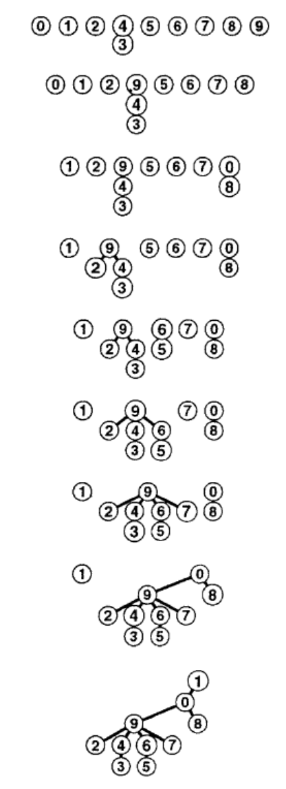

# 1. Задача связности

Постановка:

> Дан набор целых чисел, представляющих объекты сети. Пара чисел **p-q** означает, что между двумя данными объектами существует непосредственная связь. На вход подаётся последовательность пар **p-q** - необходимо исключить те пары, для которых объекты **p** и **q** уже достижимы друг из друга по некоторому существующему пути.

Возможные формулировки задачи связности:

+ построение остовного дерева: определить, нужно ли устанавливать новое прямое соединение между парой объектов *p* и *q* в сети или можно использовать уже существующий путь;
+ определить, являются ли два любых объекта *p* и *q* сети связанными между собой;
+ определить, достаточно ли *M* связей для соединения всех *N* объектов сети.

Задача связности решается посредством создания наборов чисел, хранящих все связанные между собой объекты. Должны существовать операции *find* для поиска набора, содержащего заданное число, и *union* для объединения двух наборов. При считывании пары **p-q** выполняется поиск *find* наборов, содержащих каждое из чисел **p** и **q**. Если члены пары находятся в одном наборе, то пара отбрасывается. Если члены пары находятся в разных наборах, то для них выполняется объединение *union*.

## 1.1. Алгоритмы объединение-поиск

Будем хранить общий набор чисел (например, в виде массива), сопоставляя с каждым содержащий его поднабор.

### 1.1.1. Алгоритм быстрого поиска (медленного объединения)

Запись для каждого числа в массиве хранит некоторое число, являющееся ведущим элемент поднабора, содержащего данное число. Для определения, связаны ли два числа **p** и **q** - операция *find* - нужно всего-лишь сравнить значения элементов массива под соответствующими индексами - это выполняется мгновенно (за константу). Для объединения двух наборов - операция *union* - нужно проитерировать все элементы массива и изменить значение относящихся к первому набору на ведущий элемент второго набора - это требует *N* итераций. Изначально каждое число находится в своём собственном наборе.

```C++
int parents[N] = {0, 1, 2, ... N-1};

void union_find(int p, int q) {
    if(parents[p] == parents[q])
        return;
    for(int& parent : parents)
        if(parent == parents[p])
            parent = parents[q];
}
```


Если имеется *N* чисел, для которых на вход подаётся *M* пар, то операция требует *MN* итераций.

### 1.1.2. Алгоритм быстрого объединения (не очень быстрого поиска)

Запись для каждого числа в массиве хранит следующее число, содержащееся в том же самом поднаборе - финальное число указывает само на себя. При выполнении операции *find* для чисел **p** и **q** нужно проитерировать все указатели каждого из наборов (НЕ все элементы массива, а только часть!) и сравнить значения финальных элементов. Для объединения двух наборов *union* нужно перенести указатель финального элемента одного набора на финальный элемент второго набора - это выполняется мгновенно (за константу).

```C++
int parents[N] = {0, 1, 2, ... N-1};

void union_find(int p, int q) {
    int i = p, j = q;
    while(i != parents[i])
        i = parents[i];
    while(j != parents[j])
        j = parents[j];
    if(i == j)
        return;
    parents[i] = j;
}
```



Алгоритм быстрого объединения является усовершенствованием, т.к. устраняет необходимость выполнить в общей сложности *MN* итераций для *N* имеющихся чисел и *M* входных пар. Однако он не может *гарантировать* на порядок более быстрое исполнение.

Приведем пример входных данных, приводящий к неоптимальному решению. Пусть *M >> N*. Cначала вводится *N-1* пар, связывающих *1* с остальными числами по возрастанию: *1-2*, *1-3* и далее *1-N*. Результирующее дерево связей будет представлять собой прямую линию от *1* до *N*. Все последующие пары будут связывать *1* с любыми другими числами - в результате для определения финального элемента набора, содержащего *1*, придётся каждый раз проходить весь путь *1...N*. В общей сложности алгоритм выполнит $(N-1)(M - N/2)$ переходов по указателям.

### 1.1.3. Взвешенное быстрое объединение

Вместо того чтобы каждый раз соединять первое дерево со вторым, введем дополнительный массив с размерами получаемых поднаборов и будем всегда добавлять меньшее дерево к корню большего. Это предотвратит разрастание длинных путей и избавит от случаев, когда к корень уже существующего пути последовательно переносится всё дальше от крайнего элемента.
