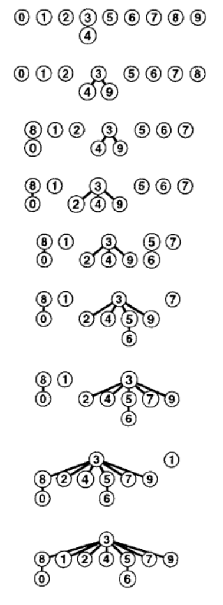
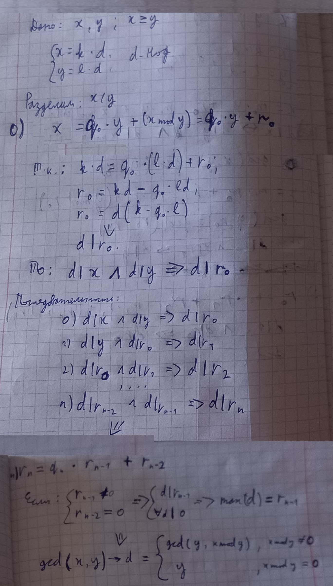

# 1. Задача связности

Постановка:

> Дан набор целых чисел, представляющих объекты сети. Пара чисел **p-q** означает, что между двумя данными объектами существует непосредственная связь. На вход подаётся последовательность пар **p-q** - необходимо исключить те пары, для которых объекты **p** и **q** уже достижимы друг из друга по некоторому существующему пути.

Возможные формулировки задачи связности:

+ построение остовного дерева: определить, нужно ли устанавливать новое прямое соединение между парой объектов *p* и *q* в сети или можно использовать уже существующий путь;
+ определить, являются ли два любых объекта *p* и *q* сети связанными между собой;
+ определить, достаточно ли *M* связей для соединения всех *N* объектов сети.

Задача связности решается посредством создания наборов чисел, хранящих все связанные между собой объекты. Должны существовать операции *find* для поиска набора, содержащего заданное число, и *union* для объединения двух наборов. При считывании пары **p-q** выполняется поиск *find* наборов, содержащих каждое из чисел **p** и **q**. Если члены пары находятся в одном наборе, то пара отбрасывается. Если члены пары находятся в разных наборах, то для них выполняется объединение *union*.

## 1.1. Алгоритмы объединение-поиск

Будем хранить все числа в единственном общем наборе (например, в виде массива), сопоставляя с каждым числом содержащий его поднабор.

### 1.1.1. Алгоритм быстрого поиска (медленного объединения)

Запись для каждого числа в массиве хранит некоторое число, являющееся ведущим элемент поднабора, содержащего данное число. Для определения, связаны ли два числа **p** и **q** - операция *find* - нужно всего-лишь сравнить значения элементов массива под соответствующими индексами - это выполняется мгновенно (за константу). Для объединения двух наборов - операция *union* - нужно проитерировать *весь массив* и установиь значением элементов, относящихся к первому набору, ведущий элемент второго набора - это требует *N* итераций. Изначально каждое число находится в своём собственном наборе.

```C++
int parent[N] = {0, 1, 2, ... N-1};

void union_find(int p, int q) {
    if(parent[p] == parent[q])
        return;
    for(int& par : parent)
        if(par == parent[p])
            par = parent[q];
}
```


Если имеется *N* чисел и *M* пар, то решение задачи потребует выполнить *MN* итераций по массиву.

### 1.1.2. Алгоритм быстрого объединения (не очень быстрого поиска)

Запись для каждого числа в массиве хранит следующее число, содержащееся в том же самом поднаборе - финальное число указывает само на себя. При выполнении операции *find* для чисел **p** и **q** нужно проитерировать оба поднабора и сравнить значения их финальных элементов. Для объединения двух наборов - *union* - нужно перенести указатель финального элемента одного набора на финальный элемент второго набора - это выполняется мгновенно (за константу).

```C++
int parent[N] = {0, 1, 2, ... N-1};

void union_find(int p, int q) {
    int i = p, j = q;
    while(i != parent[i])
        i = parent[i];
    while(j != parent[j])
        j = parent[j];
    if(i == j)
        return;
    parent[i] = j;
}
```


Алгоритм быстрого объединения является усовершенствованием, т.к. устраняет необходимость выполнить в общей сложности *MN* итераций для *N* имеющихся чисел и *M* входных пар. Однако он не может *гарантировать* на порядок более быстрое исполнение.

Приведем пример входных данных, приводящий к неоптимальному решению. Пусть *M >> N*. Cначала вводится *N-1* пар, связывающих *1* с остальными числами по возрастанию: *1-2*, *1-3* ... *1-N*. Результирующее дерево связей будет представлять собой прямую линию от *1* до *N*. Все последующие пары будут связывать *1* с любыми другими числами - в результате для определения финального элемента набора, содержащего *1*, придётся каждый раз проходить весь путь *1...N*. В общей сложности алгоритм выполнит $(N-1)(M - N/2)$ переходов по указателям.

### 1.1.3. Взвешенное быстрое объединение

Вместо того чтобы каждый раз соединять первое дерево со вторым, введем дополнительный массив с размерами получаемых поднаборов и будем всегда добавлять меньшее дерево к корню большего. Это предотвратит разрастание длинных путей и избавит от случаев, когда корень уже существующего пути последовательно переносится всё дальше от крайнего элемента.

```C++
int parent[N] = {0, 1, 2, ... N-1};
int size[N] = {1, 1, 1, ... 1};

void union_find(int p, int q) {
    int i = p, j = q;
    while(i != parent[i])
        i = parent[i];
    while(j != parent[j])
        j = parent[j];
    if(i == j)
        return;
    if(size[i] < size[j]) {
        parent[i] = j;
        size[j] += size[i];
    }
    else {
        parent[j] = i;
        size[i] += size[j];
    }
}
```



Для определения, связаны ли два объекта **p** и **q**, алгоритму взвешенного быстрого объединения требуется отследить максимум $log_2N$ указателей, а в общей сложности для *M* пар будет выполнено не более $Mlog_2N$ переходов по указателям. Это означает, что взвешенное быстрое объединение гарантирует эффективное выполнение и не зависит от характера входных данных.

### 1.1.4. Взвешенное быстрое объединение со сжатием пути делением пополам

В идеале хотелось бы, чтобы каждый объект непосредственно указывал на вершину - длина пути в этом случае равнялась бы 1, и можно было бы мгновенно определить набор, содержащий данный объект (как в случае быстрого поиска). Это можно достичь дополнительным выполнением *сжатия пути*. Одной из стратегий сжатия является *деление пополам*: при обходе пути в процессе операции *find* для каждого посещаемого элемента указатель его предка дополнительно переносится с родителя на деда. Очевидно, что финальный элемент поднабора является также является своим дедом, как и своим родителем.

```C++
int parent[N] = {0, 1, 2, ... N-1};
int size[N] = {1, 1, 1, ... 1};

void union_find(int p, int q) {
    int i = p, j = q;
    while(i != parent[i]) {
        // устанавливаем предком узла его деда.
        parent[i] = parent[parent[i]];
        i = parent[i];
    }
    while(j != parent[j]) {
        // устанавливаем предком узла его деда.
        parent[j] = parent[parent[j]];
        j = parent[j];
    }
    // перестановка узлов наборов не изменила их вес.
    if(i == j)
        return;
    // если наборы разные, то объединим их.
    if(size[i] < size[j]) {
        parent[i] = j;
        size[j] += size[i];
    }
    else {
        parent[j] = i;
        size[i] += size[j];
    }
}
```

Многократное прохождение путей приводит к превращению дерева в плоское, состоящее только из корня и листьев.

# 2. Рекурсия и деревья

## 2.1. Рекурсивные алгоритмы

**Рекурсивный алгоритм** - сводит исходную задачу к одной или нескольким *более узким* и **непересекающимся** подзадачам, а затем решает уже их.

Рекурсивный алгоритм **завершается** за **конечное** число шагов для **любых** допустимых входных данных, если:

+ рекурсивная функция решает задачу для терминального значения параметра без порождения нового рекурсивного вызова (только на основе входных данных);
+ рекурсивная функция при решении задачи для промежуточного значения параметра порождает новый рекурсивный вызов, принимающий более близкое к терминальному значениие параметра;

Т.е. последовательность входных параметров серии рекурсивных вызовов является строго убывающей (если терминальный параметр - минимум) либо строго возрастающей (если терминальный параметр - максимум).

Данный признак очевиден, т.к. с каждым новым рекурсивным вызовом входной параметр всё ближе приближается к своему терминальному значению, нахождение решения для которого останавливает процесс порождения вызовов. Затем происходит размотка рекурсии в обратном направлении с использованием уже найденных решений. Если же одно из этих условий нарушается, и, например, новый вызов совершается со входным значением, расположенным от терминального дальше, чем текущее, то алгоритм может попасть в бесконечную последовательность таких приближений-отдалений - в конечном счете он аварийно завершится переполнением стека вызовов.

---

Пример: **Алгоритм Евклида НОД**

```C++
int gcd(int m, int n) {
    return (n == 0) ? m : gcd(n, m % n);
}
```



---

*Рекурсию* всегда можно преобразовать в **итерационный цикл**. Верно и обратное утвержднение: любой *цикл* можно заменить эквивалетной *рекурсией*. Однако на практике подобную обратную замену не используют, т.к. для длинных циклов она приводит к переполнению стека вызовов (и перерасходу памяти из-за дублирования прочего содержимого стекового кадра).

С переполнением стека можно бороться преобразованием рекурсии в **хвостовую форму**: если рекурсивный вызов - это последнее совершаемое данной функцией действие, то новый кадр может быть записан прямо поверх текущего, вместо помещения на вершину стека. В таких случаях все служебные данные обычно передаются из вызова в вызов через его параметры.

Пример: **Хвостовая рекурсия**

```C++
// обычный факториал.
int fact(int n) {
    return (n == 0) ? 1 : n*fact(n-1);
}

// факториал с хвостовой рекурсией.
int fact_tail(int n, int accum = 1) {
    return (n == 0) ? accum : fact(n-1, n*accum);
}
```

Хвостовая оптимизация **НЕ гарантируется** стандартом С++, однако современные компиляторы её поддерживают и выполняют при взведении соответствующих флагов (`-O2` и проч.).
